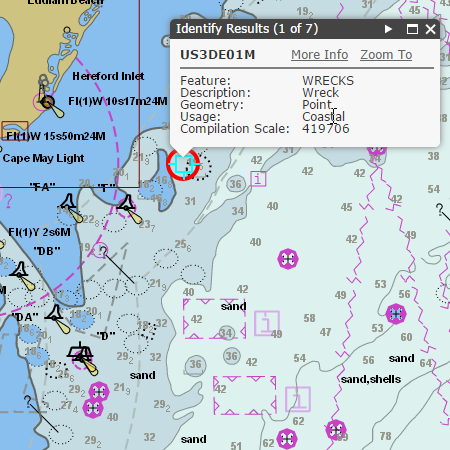

# mcs-widgets

The Maritime Chart Service widgets are widgets and dojo classes that illustrate how web applications can consume and interact with the Maritime Chart Service exposed by the ArcGIS for Maritime: Server product.
The widgets can be used directly within Web App Builder for ArcGIS. Alternatively, the source code for these widgets is available here for reuse/modification and to integrate it within custom web apps outside of the Web App Builder for ArcGIS framework.

## Sections

* [Features](#features)
* [Requirements](#requirements)
* [Instructions](#instructions)
* [Resources](#resources)
* [Issues](#issues)
* [Contributing](#contributing)
* [Licensing](#licensing)

## Features

These Web App Builder widgets illustrates how to build web apps consuming S-57 web services published from ArcGIS for Maritime: Server in a JavaScript web app.
* Allows users to change S-52 based display settings through the JavaScrip client
* Enables users to identify on individual features and view their attribute information.
* Provides the ability to search based on object name (OBJNAM) and S-57 dataset names. (functionality coming soon)

The Widget Repository currently includes:

###Maritime Chart Service Library

This is a library of custom Esri widgets and custom layer classes that extend Esri's JSAPI in order to consume the Maritime Chart Service in apps. 

###Web App Builder Widgets

The following are custom Web App Builder widgets that use the maritime chart service library above and are to be used within the Web App Builder to create custom apps, templates and themes.

* Maritime Display Properties
* Maritime Identify
* Maritime Search (functionality coming soon)

## Requirements
Requires Web App Builder for ArcGIS 1.1 for the Web App builder widgets. The Esri widgets require JS API 3.9 or less. 

## Instructions
Deploying Widgets:

1. To use the widgets, copy the ones you want to use to the Web App Builder widget directory.
⋅⋅*Copy the contents of the `src\widgets\` folder to `%webappbuilder_install%\client\stemapp\widgets\`
2. The Web App Builder widgets depend on the modules in the libs folder, so these must be copied as well to the stemapp/libs directory. This is located in %webappbuilder_install%/client directory. 
3. Since the Identify widget is an off-panel web app builder widget, the config.json file at stemapp/predefined-apps/default needs to be replaced by the [src/config.json](src/config.js) file in the repository. 
4. Since the Identify widget only supports JSAPI 3.11 and below, please replace the env.js file at %webappbuilder_install%\client\stemapp folder with the one in [src/env.js](./src/env.js)
5. Since this uses dojo bootstrap for the Display Settings widget, please replace the init.js file at %webappbuilder_install%\client\stemapp folder with the one in [src/init.js](./src/init.js)

For more resources on developing and modifying widgets please visit
[Web App Builder for ArcGIS (Developer Edition) documentation](https://developers.arcgis.com/web-appbuilder/)

### General Help
[New to Github? Get started here.](http://htmlpreview.github.com/?https://github.com/Esri/esri.github.com/blob/master/help/esri-getting-to-know-github.html)

## Resources

* Learn more about Maritime Chart Service, a functionality of the ArcGIS for Maritime: Server product [here](http://blogs.esri.com/esri/arcgis/2015/01/21/a-brief-introduction-to-the-maritime-chart-server/).

## Issues

* Find a bug or want to request a new feature?  Please let us know by submitting an issue.

## Contributing

Esri welcomes contributions from anyone and everyone. Please see our [guidelines for contributing](https://github.com/esri/contributing).

If you are using [JS Hint](http://http://www.jshint.com/) there is a .jshintrc file included in the root folder which enforces this style.
We allow for 120 characters per line instead of the highly restrictive 80.

## Licensing

Copyright 2013 Esri

Licensed under the Apache License, Version 2.0 (the "License");
you may not use this file except in compliance with the License.
You may obtain a copy of the License at

   http://www.apache.org/licenses/LICENSE-2.0

Unless required by applicable law or agreed to in writing, software
distributed under the License is distributed on an "AS IS" BASIS,
WITHOUT WARRANTIES OR CONDITIONS OF ANY KIND, either express or implied.
See the License for the specific language governing permissions and
limitations under the License.

A copy of the license is available in the repository's
[license.txt](license.txt) file.

